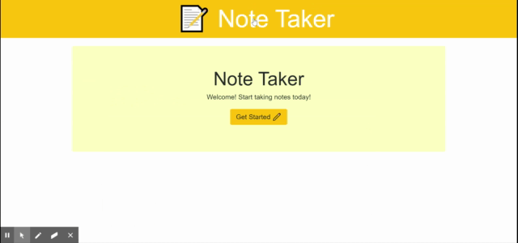

# Note Taker

Real-time note taking application. Take notes, update them, and delete them with this note-taker.

## Getting Started

Steps to run application:
1. Clone git repository
2. Install dependencies
3. Start the application with an empty db.json file
4. run app

```
git clone git@github.com:kqarlos/note-taker.git
npm install
node server.js

```

## Site Pictures

* Working app




## Code Snippets


1. app.post();

```javascript
app.post("/api/notes", function (req, res) {
    console.log("New Note ====================");
    fs.readFileSync('db.json', (err, data) => {
        if (err) throw err;
        notes = JSON.parse(data);
    });

    var newNote;
    if (req.body.id == -1) {
        newNote = new Note(req.body.title, req.body.body);
        notes.push(newNote);

    } else {
        newNote = req.body;
        for (var i = 0; i < notes.length; i++) {
            if (newNote.id == notes[i].id) {
                notes.splice(i, 1, newNote);
            }
        }
    }

    console.log(newNote);

    fs.writeFile("db.json", JSON.stringify(notes), (err) => {
        if (err) throw err;
        console.log('The file was updated!');
    });

    res.json(notes);
});

```
* This function is called when a note is either created or updatd. It uses Express' _post()_ function to facilitate the way in which information is received. using req.body I can easily access and process the information sent by the client-side javascript. Before I process the information I get a hold of all the existing notes. Then I check if the note is new or if it already exists. In which case, the information is either pushed into the array or updated. After this, the _db.json_ file gets written with the new list of notes.

2. Client to. Server side on getting a note.

```javascript

//gets a note CLIENT SIDE
$(document).on("click", ".list-group-item", function (e) {
    $("#notes").empty();
    $("#form").css("display", "none");
    $("#note").css("display", "block");
    //Gets the note id 
    var id = parseInt($(this).attr("data-id"));
    $("#noteID").append(id);
    //uses note id to query the server on that id
    $.get(`/api/notes/${id}`, function (data) {
        //updates web elements
        $("#noteTitle").val(data.title);
        $("#noteContent").val(data.body);

    });
});

// gets a note SERVER SIDE
app.get("/api/notes/:id", function (req, res) {
    var id = req.params.id;
    fs.readFileSync('db.json', (err, data) => {
        if (err) throw err;
        notes = JSON.parse(data);
    });

    console.log("Looking for note ID: " + id + "=============");

    for (var i = 0; i < notes.length; i++) {

        if (notes[i].id == id) {
            console.log("Found:");
            console.log(notes[i]);
            return res.json(notes[i]);
        }
    }

    res.json(id);
})
    
```
* These two pieces of code show how information is processed on the client side and then sent over to the server to be retrieved from the _db.json_ file. On the client-side, the _note.id_ is retrieved from the DOM. The _note.id_ is sent to the server with a _get()_ method. On the server side _Express_ receives the id and with this, the Note is retreived form the _db.json_ file. Now, the _Note_ object is returned to the client-side and processed to be displayed on the user's screen.


## Built With

* [HTML](https://developer.mozilla.org/en-US/docs/Web/HTML)
* [CSS](https://developer.mozilla.org/en-US/docs/Web/CSS)
* [Bootstrap](https://getbootstrap.com/)
* [Javascript](https://www.javascript.com/)
* [Node.js](https://nodejs.org/en/)
* [Express](https://www.npmjs.com/package/express)

## Deployed Link

* [See Live Site](https://note-taker2020.herokuapp.com/)

## Author

 * **Carlos Toledo** 

## Links

- [Link to site repository](https://github.com/kqarlos/note-taker)
- [Link to Github](https://www.github.com/kqarlos)
- [Link to LinkedIn](https://www.linkedin.com/in/carlos-toledo415/)


## Acknowledgments

* [W3 Schools](https://www.w3schools.com/)
* [Bootstrap components](https://getbootstrap.com/docs/4.4/components/navbar/)
* [MDN Web Docs](https://developer.mozilla.org/en-US/docs/Web/API/Document_Object_Model)